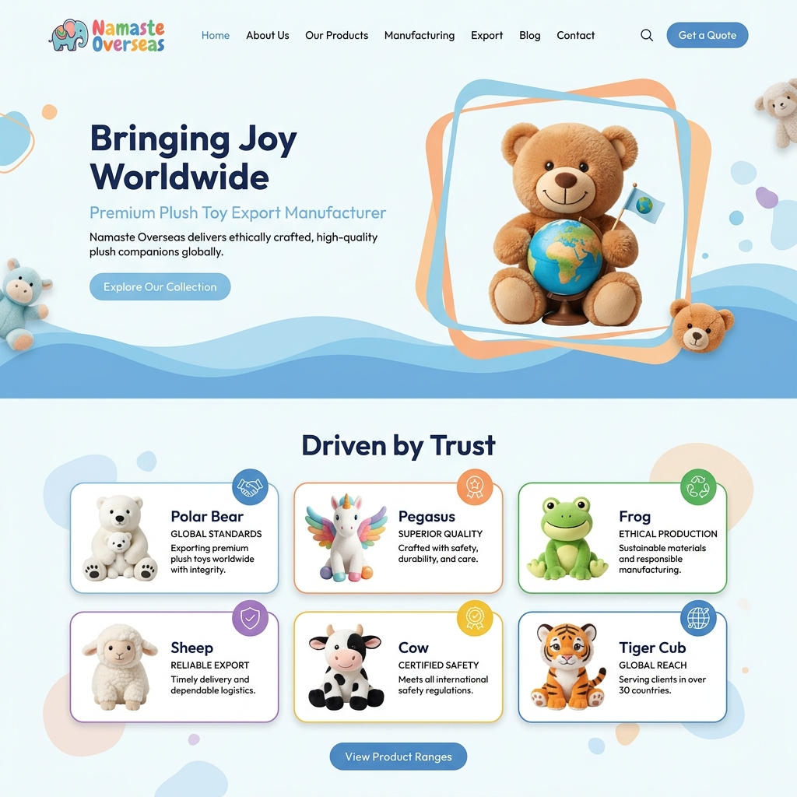
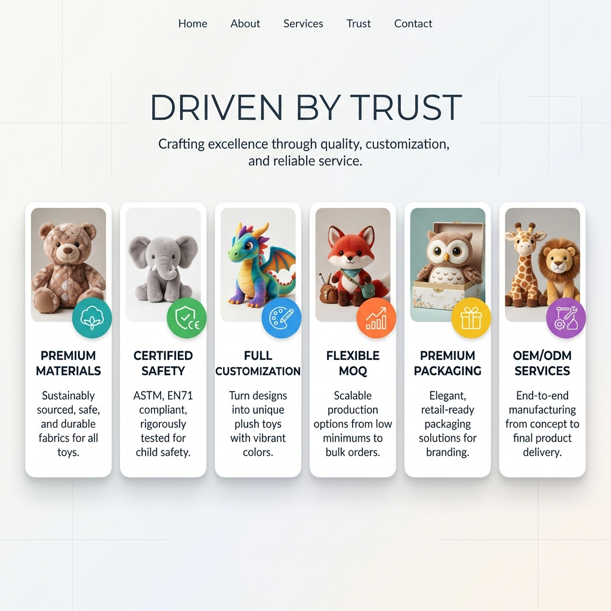
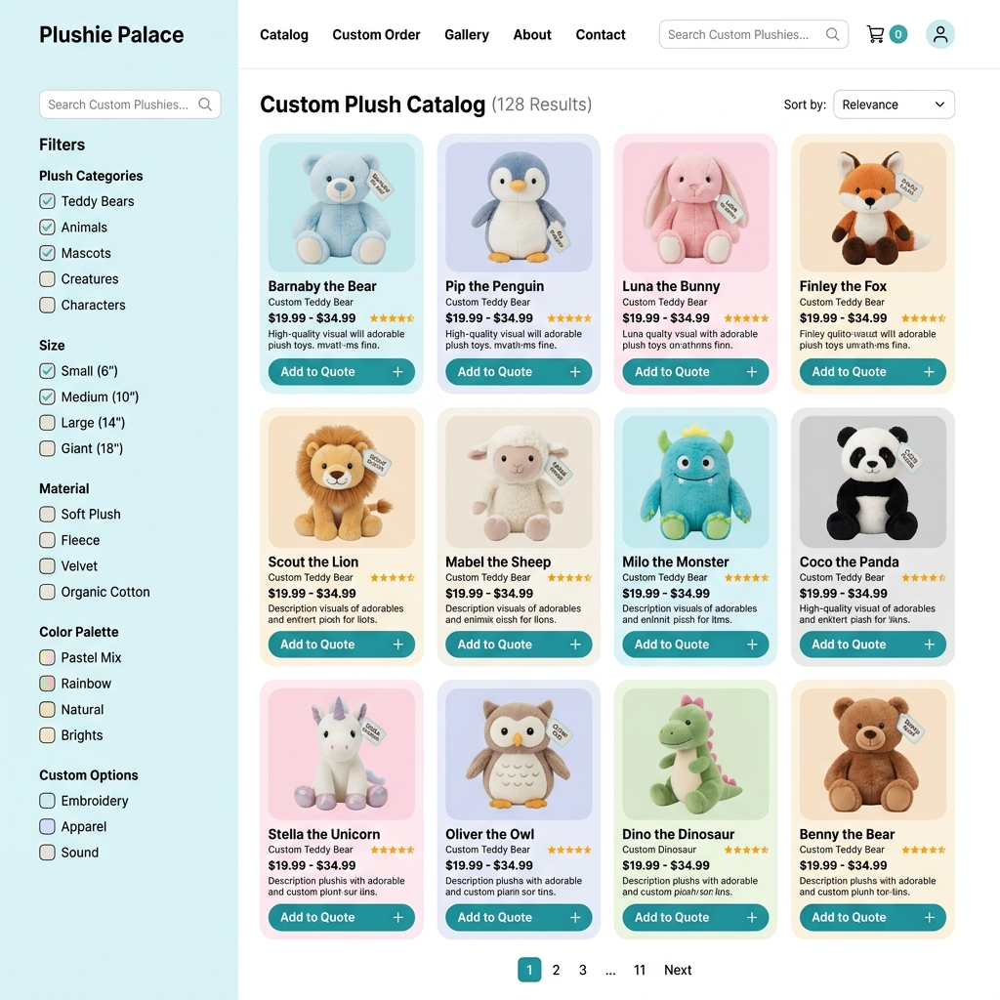
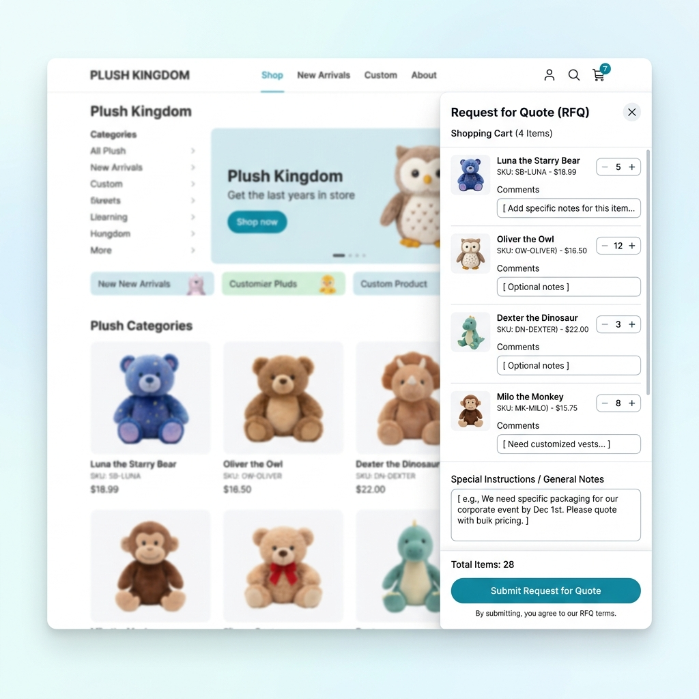

# Namaste Overseas | Premium Plush Toy Export Website

A premium, highly interactive, and responsive web application built for **Namaste Overseas**—a leading custom plush toy manufacturer and exporter. The website showcases their manufacturing capabilities, certifications, and a full catalog of 53 custom plush toys, complete with an interactive Request for Quote (RFQ) system.

---

## 📸 Website Preview & Screenshots

Here is a visual overview of the website layout and features:

### 1. Homepage & Hero Banner
Shows the modern floating hero layout with animated background waves:


### 2. 'Driven by Trust' Features Section
Features custom overlapping colored badges and plush product images:


### 3. Interactive Products Catalog
Demonstrates the client-side search, sorting, and tag-filtering engine:


### 4. Quote Request (RFQ) Drawer
Shows the slide-out bulk inquiry list and quote submission layout:


---

## ✨ Key Features

* **3D Animated Hero Card**: Continuously bobs and floats dynamically on all screen dimensions without needing mouse movement.
* **Organic Ocean Wave Fills**: Infinite scrolling, organic double-wavelength background waves inside hero panels to align with the name "Overseas".
* **Overlapping Feature Grid**: Clean layout containing catalog product representations inside rounded frames, offset by colored circular badges.
* **Product Catalog (53 Items)**: Interactive client-side products table sourced from `data.js`. Supports search queries, category tagging, alphabetical sorting, and detail modals.
* **RFQ Shopping Cart Drawer**: Users can add products with custom bulk comments and download/submit inquiries directly to the export desk.
* **Responsive Layouts**: Scaled and adapted via custom media queries for seamless display across mobile, tablet, and widescreen desktops.
* **Modern Design Tokens**: Utilizes a pastel violet-coral CSS variable palette, Outfit typography, and custom glassmorphic overlay shadows.

---

## 🚀 How to Run Locally

Since this is a lightweight, static web application, there are no complicated installation steps:

### Option A: Double-Click (Instant)
1. Open the project folder on your computer.
2. Double-click the **`index.html`** file. It will launch directly in your default web browser.

### Option B: Local Server (Recommended for perfect asset loading)
To prevent local file restriction policies from blocking some video/image assets in your browser, run a quick local HTTP server:

#### Using Python (If installed):
1. Open your terminal in the project directory.
2. Run:
   ```bash
   python -m http.server 8000
   ```
3. Open **`http://localhost:8000`** in your browser.

#### Using VS Code (Live Server):
1. Open the folder in VS Code.
2. Install the **"Live Server"** extension.
3. Click the **"Go Live"** button at the bottom-right corner.

---

## 🛠️ Technology Stack

* **Structure:** HTML5 (semantic layout)
* **Styling:** CSS3 (modern layouts: Grid and Flexbox, custom keyframes, variables)
* **Scripting:** JavaScript (ES6+ client-side logic, dynamic grid injections, DOM routing)
* **Assets:** Custom photography assets (Products 1-53) and vector SVGs.
